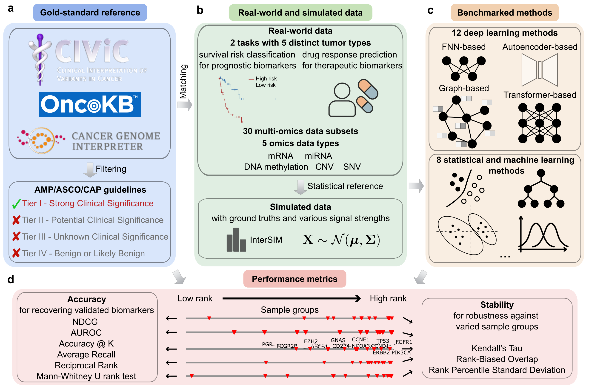
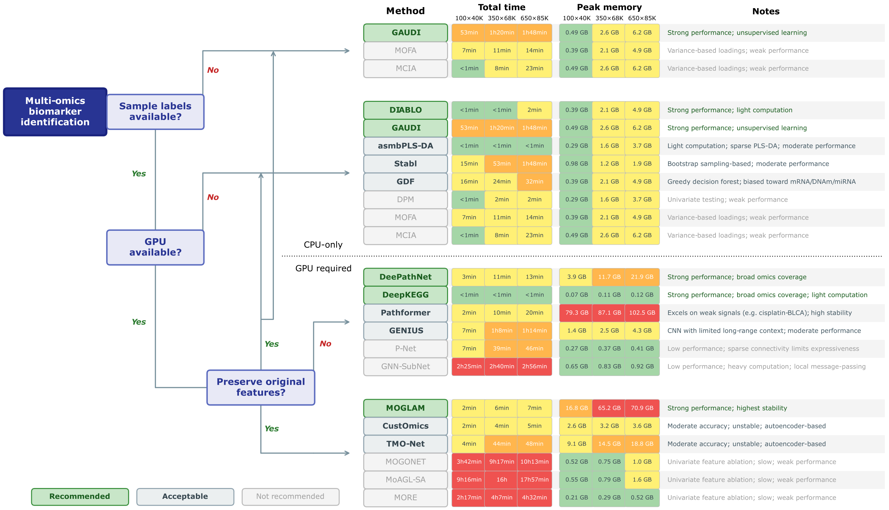

# CancerMOBI-Bench: Cancer Multi-Omics Biomarker Identification Benchmark

[](https://doi.org/10.64898/2025.12.18.695266)
[](https://zenodo.org/records/17860662)
[](https://www.python.org/)
[](LICENSE)

**CancerMOBI-Bench** is a benchmark for evaluating computational methods for multi-omics biomarker identification in cancer. It evaluates methods against clinically validated reference biomarkers across 5 TCGA cancer datasets and 20 baseline methods.

> **Paper**: Athan Z. Li, Yuxuan Du, Yan Liu, Liang Chen, Ruishan Liu. [*Benchmarking computational methods for multi-omics biomarker discovery in cancer*](https://doi.org/10.64898/2025.12.18.695266). bioRxiv (2025).

This repository supports two main use cases:

1. **Benchmark your method**: Run your own method and compare its biomarker identification performance against 20 baselines.
2. **Discover candidate biomarkers**: Run recommended benchmarked methods on custom multi-omics data and aggregate via Robust Rank Aggregation (RRA) to produce a consensus candidate biomarker list.



---

## Table of Contents

- [Installation](#installation)
  - [Download the benchmark data](#download-the-benchmark-data)
  - [Dependencies](#dependencies)
- [Use Case 1: Benchmark your method](#use-case-1-benchmark-your-method)
  - [Step 1: Implement your method's wrapper function](#step-1-implement-your-methods-wrapper-function)
  - [Step 2: Run the benchmark](#step-2-run-the-benchmark)
  - [View the results](#view-the-results)
- [Use Case 2: Discover candidate biomarkers](#use-case-2-discover-candidate-biomarkers)
  - [Additional dependencies](#additional-dependencies)
  - [Step 1: Run benchmarked methods](#step-1-run-benchmarked-methods)
  - [Step 2: Aggregate rankings with RRA](#step-2-aggregate-rankings-with-rra)
- [Available datasets](#available-datasets)
- [Evaluation metrics](#evaluation-metrics)
- [Citation](#citation)

---

## Installation

### Download the benchmark data

Download `data.zip` from https://zenodo.org/records/17860662 and place it in the repository root directory. Then run:

```bash
mkdir -p data && unzip data.zip -d data
```

This creates a `data/` directory under the repository root. At a minimum, the following files must exist:

- `<repo_root>/data/TCGA/TCGA_cpg2gene_mapping.csv`
- `<repo_root>/data/TCGA/TCGA_miRNA2gene_mapping.csv`
- `<repo_root>/data/bk_set/processed/survival_task_bks.csv`
- `<repo_root>/data/bk_set/processed/drug_response_task_bks.csv`
- `<repo_root>/data/TCGA/<task_name>/*_CNV+DNAm+SNV+mRNA+miRNA.pkl` (for each task you run)

### Dependencies

- Python 3.10+ recommended

```bash
python -m pip install numpy pandas scipy scikit-learn matplotlib seaborn rbo
```

---

## Use Case 1: Benchmark your method

This section guides you through running your method on our benchmark pipeline to compare its biomarker identification performance against 20 baselines. The process consists of two main steps:

1. Implement a wrapper function for your method
2. Run the benchmark using the provided pipeline

### Step 1: Implement your method's wrapper function

Create a function that wraps your method and follows the required signature.

```python
def run_method_custom(
    X_train,
    y_train,
    X_val,
    y_val,
    X_test,
    y_test,
    mode: int = 0,  # Required parameter - see "mode" section below
):
    """
    A custom function to run your method for benchmarking.
    The pipeline provides pre-split train/val/test data, but you are not
    required to use all of them. For example, you may only use the training
    set if your method does not need validation or test data.

    Args:
        X_train (pd.DataFrame): Training features.
            - Index: sample IDs
            - Columns: feature names in "MOD@feature" format (e.g., "mRNA@TP53", "DNAm@cg00000029")
        y_train (pd.DataFrame): Training labels.
            - Index: sample IDs
            - Column: 'label' (for binary classification) or 'T', 'E' (for survival analysis)
            - For survival tasks, labels are provided as binary (high/low risk) by default,
              split at the median survival time. You can also set a custom survival time
              cutoff (e.g., 365 days, 1825 days) via the `surv_op` parameter in `run_benchmark()`.
        X_val (pd.DataFrame): Validation features (same format as X_train)
        y_val (pd.DataFrame): Validation labels (same format as y_train)
        X_test (pd.DataFrame): Test features (same format as X_train)
        y_test (pd.DataFrame): Test labels (same format as y_train)
        mode (int): Specifies the format of your output feature scores (see below)

    Returns:
        ft_score (pd.DataFrame): Feature importance scores.
            - Index: feature names (see formats below)
            - Single column: importance scores (higher = more important)
    """
    # Your method implementation here
    ...
    return ft_score
```

#### Input data format

| Omics Type | Feature Level | Example Feature Names |
|------------|---------------|----------------------|
| mRNA | Gene-level | `mRNA@TP53`, `mRNA@KRAS`, `mRNA@EGFR` |
| CNV | Gene-level | `CNV@APOC1`, `CNV@MYC`, `CNV@ERBB2` |
| SNV | Gene-level | `SNV@TP53`, `SNV@BRAF`, `SNV@PIK3CA` |
| DNAm | CpG-level | `DNAm@cg00000029`, `DNAm@cg22832044` |
| miRNA | miRNA-level | `miRNA@hsa-miR-100-5p`, `miRNA@hsa-let-7a-5p` |

#### Output format: `ft_score`

Your function must return a pandas DataFrame with:
- **Index**: Feature names in **`MOD@molecule_name`** format (e.g., `mRNA@TP53`, `DNAm@cg00000029`, `miRNA@hsa-miR-100-5p`)
- **Single column**: Importance scores where **higher values indicate greater importance**

> ⚠️ The index of `ft_score` **must** use the `MOD@molecule_name` format, where `MOD` is one of `mRNA`, `CNV`, `SNV`, `DNAm`, or `miRNA`. This format is required for the benchmark to correctly process and evaluate your results. The only exception is when using `mode=2`, where gene names without modality prefix are accepted.

> ⚠️ If your method produces scores where sign indicates directionality (not importance), convert to absolute values before returning.

#### The `mode` parameter

The `mode` parameter tells the benchmark how to interpret your feature names during evaluation. All evaluations are performed at the gene level (the benchmark automatically maps CpG and miRNA features to genes using provided mapping files), so the benchmark needs to know how to convert your scores.

| Mode | Description | Feature Name Format | Example |
|------|-------------|---------------------|---------|
| `0` | Molecule-centric (default for most methods) | Original molecule-level names with modality prefix | `DNAm@cg00000029`, `miRNA@hsa-miR-100-5p`, `mRNA@TP53` |
| `1` | Gene-centric with modality | Gene names with modality prefix | `DNAm@TP53`, `miRNA@KRAS`, `mRNA@EGFR` |
| `2` | Gene-centric without modality | Gene names only (no modality prefix) | `TP53`, `KRAS`, `EGFR` |

**Choose based on your method's output:**
- **Mode 0**: Your method operates on original features and outputs scores for CpGs, miRNAs, genes, etc.
- **Mode 1**: Your method maps features to genes but retains modality information (e.g., distinguishes `DNAm@TP53` from `mRNA@TP53`)
- **Mode 2**: Your method outputs gene-level scores without distinguishing which omics type the score came from

#### Example implementation

```python
def run_method_custom(
    X_train, y_train,
    X_val, y_val,
    X_test, y_test,
    mode: int = 0,  # Mode 0: molecule-level output
):
    """Example wrapper for a random forest-based feature selection method."""
    from sklearn.ensemble import RandomForestClassifier
    import pandas as pd
    import numpy as np

    y_trn = y_train['label'].values

    model = RandomForestClassifier(n_estimators=100, random_state=42)
    model.fit(X_train.values, y_trn)

    importances = model.feature_importances_

    ft_score = pd.DataFrame(
        index=X_train.columns,
        data={'score': importances}
    )

    return ft_score
```

---

### Step 2: Run the benchmark

Pass your wrapper function to `run_benchmark()`. The benchmark uses 5-fold cross-validation with pre-defined splits to ensure reproducibility and fair comparison across methods.

```python
from benchmark_pipeline import run_benchmark

# Run benchmark with default settings (all datasets, all omics combinations, all folds)
acc_res, sta_res = run_benchmark(
    run_method_custom_func=run_method_custom,
)
```

> 💡 **Recommendation**: We recommend using the **default settings** (all five datasets, all six omics combinations, all five folds) for comprehensive evaluation. You are free to customize these settings if you are only interested in certain task datasets (e.g., survival only), your method is specifically designed for certain omics combinations, or if you need to save time during evaluation.

The benchmark automatically handles train/validation/test splitting, label preparation, and data scaling. Your method receives pre-processed data ready for model training/running.

#### Configuration options

```python
acc_res, sta_res = run_benchmark(
    run_method_custom_func=run_method_custom,

    # Select specific dataset(s) - default: all datasets [0,1,2,3,4]
    datasets_to_run=[0, 1],  # Run on BRCA and LUAD survival tasks
    # Or use string names:
    # datasets_to_run=['survival_BRCA', 'survival_LUAD'],

    # Select specific omics combination(s) - default: all 6 tri-omics combinations (with mRNA included)
    omics_types=['DNAm', 'mRNA', 'miRNA'],  # Single combination as a list
    # Or multiple combinations as a list of lists:
    # omics_types=[['DNAm', 'mRNA', 'miRNA'], ['CNV', 'mRNA', 'miRNA']],

    # Select specific fold(s) - default: all 5 folds (0-4)
    fold_to_run=[0, 1, 2],  # Run only folds 0, 1, 2
    # Or single fold:
    # fold_to_run=0,

    # Survival label handling - default: 'binary'
    # By default, survival times are converted to binary labels (long/short based on median).
    # Set to 'continuous' if your method handles survival analysis directly (with censoring info).
    surv_op='binary',

    # Data scaling method - default: 'standard'
    scaling='standard',  # Z-score normalization
    # scaling='minmax',  # Min-max normalization (0-1)
    # scaling=None,  # No scaling

    # Output path - default: './result/'
    res_save_path='./result/my_method/',
)
```

#### Default omics combinations

When `omics_types=None` (default), the benchmark runs on all 6 tri-omics combinations that include mRNA:

1. `['DNAm', 'mRNA', 'miRNA']`
2. `['CNV', 'mRNA', 'miRNA']`
3. `['SNV', 'mRNA', 'miRNA']`
4. `['DNAm', 'CNV', 'mRNA']`
5. `['DNAm', 'SNV', 'mRNA']`
6. `['CNV', 'SNV', 'mRNA']`

#### Custom omics combinations

You are free to set `omics_types` to other combinations beyond the default tri-omics sets. For example:
- **One omics type**: `['mRNA']`, `['miRNA']`, etc.
- **Two omics**: `['mRNA', 'DNAm']`, etc.
- **Four omics**: `['mRNA', 'DNAm', 'CNV', 'miRNA']`, etc.
- **Five omics**: `['mRNA', 'DNAm', 'CNV', 'SNV', 'miRNA']`, etc.
- **Tri-omics without mRNA**: `['DNAm', 'CNV', 'miRNA']`, etc.

In such cases, the generated comparison plots will display your method's results for the specified omics combinations alongside baseline results averaged across all default omics combinations and folds. While you can still get a sense of your method's relative performance, note that these comparisons are not strictly direct since the baselines use different omics combinations.

#### Understanding the generated plots

The benchmark automatically generates comparison plots saved to `./figures/`. The baseline results shown in these plots depend on your configuration:

- **Default settings** (`omics_types=None`, `fold_to_run=None`): Plots show baseline results averaged across all 6 tri-omics combinations and all 5 folds
- **Specific omics/folds specified**: Plots filter baseline results to match only the omics combinations and folds you specified
- **Custom omics combinations** (not in the default 6): Plots show baseline results averaged across all default combinations, providing a reference comparison (though not strictly equivalent)

---

### View the results

After running the benchmark, **check the generated comparison plots saved in `./figures/`**. These plots show how your method performs compared to the 20 baseline methods across all evaluation metrics.

#### Returned results

The benchmark returns two dictionaries containing evaluation metrics:

**`acc_res` - Accuracy Metrics** (per dataset × omics combination × fold):
```python
{
    'NDCG': {(dataset_name, omics_comb, fold): score, ...},  # Normalized DCG
    'RR': {(dataset_name, omics_comb, fold): score, ...},    # Reciprocal Rank
    'AR': {(dataset_name, omics_comb, fold): score, ...},    # Average Recall
    'MW_pval': {(dataset_name, omics_comb, fold): pval, ...} # Mann-Whitney p-value
}
```

**`sta_res` - Stability Metrics** (per dataset × omics combination):
```python
{
    'Kendall_tau': {(dataset_name, omics_comb): score, ...},  # Kendall's tau correlation
    'RBO': {(dataset_name, omics_comb): score, ...},          # Rank-Biased Overlap
    'PSD': {(dataset_name, omics_comb): score, ...}           # Percentile Standard Deviation
}
```

#### Saved files

```
result/                                     # Or your specified res_save_path
├── survival_BRCA/
│   └── ft_score_fold{0-4}.csv              # Feature scores for each fold
├── survival_LUAD/
│   └── ...
├── your_method_accuracy_results.pkl        # Accuracy metrics
└── your_method_stability_results.pkl       # Stability metrics

figures/                                    # Comparison plots
├── fig_overall_results.pdf                 # Overall results averaged across tasks
├── fig_task_Survival_BRCA.pdf              # Per-task results
├── fig_task_Survival_LUAD.pdf
├── fig_task_Survival_COADREAD.pdf
├── fig_task_Drug_Response_Cisplatin_BLCA.pdf
├── fig_task_Drug_Response_Temozolomide_LGG.pdf
└── fig_mw_pval_boxplots.pdf                # Mann-Whitney p-value distribution
```

---

## Use Case 2: Discover candidate biomarkers



This repository provides a unified Python interface (`run_method.py`) to run any of the 20 benchmarked methods on any multi-omics data, plus an aggregation utility (`aggregate_rankings.py`) to combine rankings via Robust Rank Aggregation (RRA) into a consensus candidate biomarker list.

### Additional dependencies

Running the benchmarked methods requires their respective dependencies (e.g., PyTorch, rpy2). For RRA, you also need R with the `RobustRankAggreg` package:

```bash
# Python
pip install rpy2 torch

# R (run in R console)
install.packages("RobustRankAggreg")
```

Individual methods may have additional dependencies (e.g., GNN-SubNet requires PyTorch Geometric; DIABLO and asmbPLS-DA require R packages `mixOmics` and `asmbPLS`). Refer to each method's directory under `code/selected_models/<method_name>/` for details.

### Step 1: Run benchmarked methods

Use `run_method()` from `run_method.py` to run any benchmarked method. It handles all internal dispatching and argument normalization.

```python
from run_method import run_method

# Unsupervised method (no labels needed)
ft_score = run_method('GAUDI', X_train=X_trn)

# Statistical/ML method (needs train + test)
ft_score = run_method('DIABLO', X_train=X_trn, y_train=y_trn,
                      X_test=X_tst, y_test=y_tst)

# Deep learning method (needs train + val + test + GPU)
ft_score = run_method('DeepKEGG', X_train=X_trn, y_train=y_trn,
                      X_val=X_val, y_val=y_val,
                      X_test=X_tst, y_test=y_tst, device='cuda:0')
```

The returned `ft_score` is a single-column DataFrame (column `'score'`) indexed by feature name in `MOD@molecule` format (e.g., `mRNA@TP53`, `DNAm@cg00000029`). Higher scores indicate greater importance.

#### Input data format

Feature matrices (`X_train`, `X_val`, `X_test`) must be pandas DataFrames with columns in `MOD@molecule` format:

| Omics Type | Feature Level | Example Column Names |
|------------|---------------|---------------------|
| mRNA | Gene-level | `mRNA@TP53`, `mRNA@KRAS` |
| CNV | Gene-level | `CNV@APOC1`, `CNV@MYC` |
| SNV | Gene-level | `SNV@TP53`, `SNV@BRAF` |
| DNAm | CpG-level | `DNAm@cg00000029`, `DNAm@cg22832044` |
| miRNA | miRNA-level | `miRNA@hsa-miR-100-5p` |

Label DataFrames (`y_train`, `y_val`, `y_test`) should have a single `'label'` column.

#### Available methods

| Category | Methods | Required inputs |
|----------|---------|----------------|
| Unsupervised | `GAUDI`, `MCIA` | `X_train` only |
| Statistical/ML | `DIABLO`, `asmPLSDA`, `Stabl`, `GDF` | `X_train`, `y_train`, `X_test`, `y_test` |
| Deep learning | `DeePathNet`, `DeepKEGG`, `MOGLAM`, `CustOmics`, `TMONet`, `GENIUS`, `Pathformer`, `MOGONET`, `MORE`, `MoAGLSA`, `PNet`, `GNNSubNet` | All splits + `device` |
| Other | `MOFA`, `DPM` | `X_train` (+ `y_train` for DPM) |

> If a DL method requires validation/test data that you don't have, `run_method()` will automatically split the training data or reuse available sets.

#### Notes on validation and test sets

- **Validation set** (`X_val`, `y_val`): Used only for early stopping during deep learning model training. It does not affect the final biomarker rankings.
- **Test set** (`X_test`, `y_test`): Used primarily for biomarker identification (computing feature importance scores). Some methods also report predictive performance metrics on this set.

**Recommendation for biomarker identification**: To maximize the data available for computing feature importance scores, we recommend passing your **training set** as the test set arguments (i.e., `X_test=X_train, y_test=y_train`). Using more samples for biomarker identification can yield more robust importance scores. If you are interested in evaluating predictive performance, pass a held-out validation or test set instead.

### Step 2: Aggregate rankings with RRA

Use `aggregate_rankings.py` to combine rankings from multiple methods or folds into a consensus gene ranking.

```python
from aggregate_rankings import aggregate_rankings, aggregate_rankings_from_ft_scores

# Option A: from ranked lists (feature names ordered by importance)
consensus = aggregate_rankings([ranking1, ranking2, ranking3])

# Option B: directly from feature score DataFrames
consensus = aggregate_rankings_from_ft_scores([ft_score1, ft_score2, ft_score3])

print(consensus.head(10))
# Returns a DataFrame with 'p-value' column, sorted ascending.
# Lower p-values = more consistently top-ranked across inputs.
```

#### Full example: run multiple methods and build a consensus panel

```python
from run_method import run_method, run_method_rra
from aggregate_rankings import aggregate_rankings_from_ft_scores

# Option A: run methods individually, then aggregate
ft_diablo = run_method('DIABLO', X_train=X_trn, y_train=y_trn,
                       X_test=X_tst, y_test=y_tst)
ft_kegg = run_method('DeepKEGG', X_train=X_trn, y_train=y_trn,
                     X_val=X_val, y_val=y_val,
                     X_test=X_tst, y_test=y_tst, device='cuda:0')
consensus = aggregate_rankings_from_ft_scores([ft_diablo, ft_kegg])
print(consensus.head(20))

# Option B: use run_method_rra to run multiple methods and aggregate in one call
ft_score = run_method_rra(
    ['DIABLO', 'GDF', 'DeepKEGG'],
    X_train=X_trn, y_train=y_trn,
    X_val=X_val, y_val=y_val,
    X_test=X_tst, y_test=y_tst, device='cuda:0')
print(ft_score.head(20))  # DataFrame with 'score' column (-log10 p-value from RRA)
```

> Note: `run_method_rra()` internally converts each method's output to gene-level scores before aggregation, so the returned DataFrame is indexed by gene name (without modality prefix). If you use `run_method_rra()` as a wrapper for `run_benchmark()`, set `mode=2` in your wrapper function.

---

## Available datasets

| Code | Dataset Name | Task Type | Cancer Type |
|------|--------------|-----------|-------------|
| `0` | `survival_BRCA` | Survival prediction | Breast Cancer |
| `1` | `survival_LUAD` | Survival prediction | Lung Adenocarcinoma |
| `2` | `survival_COADREAD` | Survival prediction | Colorectal Cancer |
| `3` | `drug_response_Cisplatin-BLCA` | Drug response prediction | Bladder Cancer (Cisplatin) |
| `4` | `drug_response_Temozolomide-LGG` | Drug response prediction | Low-Grade Glioma (Temozolomide) |

---

## Evaluation metrics

**Accuracy Metrics** (how well your method identifies known biomarkers):
- **AR** (Average Recall): Average recall rates of biomarkers across ranking
- **NDCG** (Normalized Discounted Cumulative Gain): Measures ranking quality, giving more weight to top-ranked features
- **RR** (Reciprocal Rank): 1/rank of the first correctly identified biomarker
- **MW_pval** (Mann-Whitney p-value): Statistical test for whether biomarker scores are significantly higher

**Stability Metrics** (how consistent are rankings across folds):
- **Kendall's tau**: Rank correlation between fold rankings
- **RBO** (Rank-Biased Overlap): Top-weighted similarity measure
- **PSD** (Percentile Standard Deviation): Variation in biomarker positions across folds (lower = more stable)

---

## Citation

```bibtex
@article{li2025benchmarking,
  title={Benchmarking computational methods for multi-omics biomarker discovery in cancer},
  author={Li, Athan Z. and Du, Yuxuan and Liu, Yan and Chen, Liang and Liu, Ruishan},
  journal={bioRxiv},
  year={2025},
  doi={10.64898/2025.12.18.695266}
}
```

Athan Z. Li, Yuxuan Du, Yan Liu, Liang Chen, Ruishan Liu. [*Benchmarking computational methods for multi-omics biomarker discovery in cancer*](https://doi.org/10.64898/2025.12.18.695266). bioRxiv (2025).
