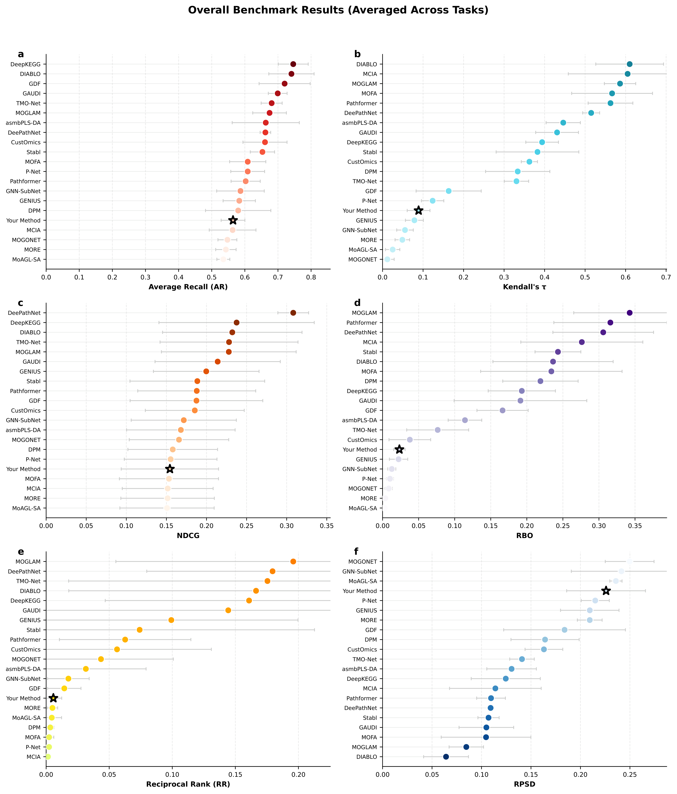
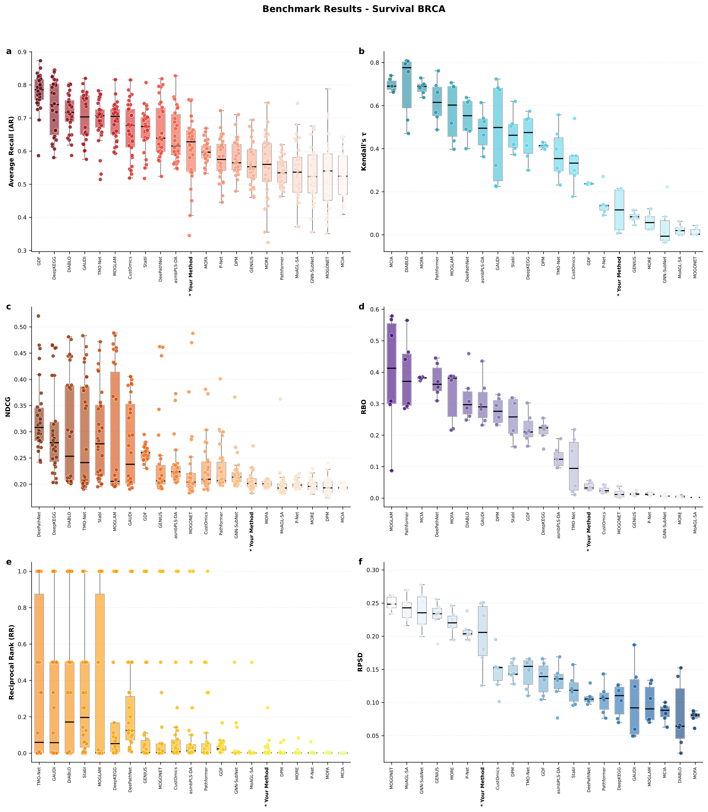

# CancerMOBI-Bench: Cancer Multi-Omics Biomarker Identification Benchmark

[](https://doi.org/10.64898/2025.12.18.695266)
[](https://zenodo.org/records/17860662)
[](https://www.python.org/)
[](LICENSE)

**CancerMOBI-Bench** is a benchmark for evaluating computational methods for multi-omics biomarker identification in cancer. It evaluates methods against clinically validated reference biomarkers across 5 TCGA cancer datasets and 20 baseline methods.

> **Paper**: Athan Z. Li, Yuxuan Du, Yan Liu, Liang Chen, Ruishan Liu. [*Benchmarking computational methods for multi-omics biomarker discovery in cancer*](https://doi.org/10.64898/2025.12.18.695266). bioRxiv (2025).

This repository supports two main use cases:

1. **Benchmark your method**: Run your own method and compare its biomarker identification performance against 20 baselines.
2. **Discover candidate biomarkers**: Run recommended benchmarked methods on custom multi-omics data and (optionally) aggregate via Robust Rank Aggregation (RRA) to produce a consensus candidate biomarker list.


---

## Table of Contents

- [Installation](#installation)
  - [Download the benchmark data](#download-the-benchmark-data)
  - [Dependencies](#dependencies)
- [Use Case 1: Benchmark your method](#use-case-1-benchmark-your-method)
  - [Step 1: Implement your method's wrapper function](#step-1-implement-your-methods-wrapper-function)
  - [Step 2: Run the benchmark](#step-2-run-the-benchmark)
  - [View the results](#view-the-results)
- [Use Case 2: Discover candidate biomarkers](#use-case-2-discover-candidate-biomarkers)
  - [Additional dependencies](#additional-dependencies)
  - [Step 1: Run benchmarked methods](#step-1-run-benchmarked-methods)
  - [Step 2: Aggregate rankings with RRA](#step-2-aggregate-rankings-with-rra)
- [Evaluation metrics](#evaluation-metrics)
- [Citation](#citation)

---

## Installation

### Download the benchmark data

Download `data.zip` from https://zenodo.org/records/17860662 and place it in the repository root directory. Then run:

```bash
mkdir -p data && unzip data.zip -d data
```

This creates a `data/` directory under the repository root. At a minimum, the following files need to exist:

- `<repo_root>/data/TCGA/TCGA_cpg2gene_mapping.csv`
- `<repo_root>/data/TCGA/TCGA_miRNA2gene_mapping.csv`
- `<repo_root>/data/bk_set/processed/survival_task_bks.csv`
- `<repo_root>/data/bk_set/processed/drug_response_task_bks.csv`
- `<repo_root>/data/TCGA/<task_name>/*_CNV+DNAm+SNV+mRNA+miRNA.pkl` (for each task you run)

### Dependencies

- Python 3.10+ recommended
- R 4.0+ (required for several benchmarked methods and RRA aggregation)

**Core packages** (required for Use Case 1: benchmarking):

```bash
pip install numpy pandas scipy scikit-learn matplotlib seaborn rbo tqdm
```

**R bridge** (required for RRA aggregation in Use Case 2, and for R-based methods such as DIABLO, GAUDI, MCIA, GDF, DPM, asmPLSDA):

```bash
pip install "rpy2>=3.5.5"
```

> **Note**: `rpy2>=3.5.5` is required for compatibility with pandas ≥2.0. Earlier versions (e.g., 3.5.3) use `iteritems()`, which was removed in pandas 2.0.

---

## Use Case 1: Benchmark your method

This section guides you through running your method on our benchmark pipeline to compare its biomarker identification performance against 20 baselines.

### Step 1: Implement your method's wrapper function

Create a function that wraps your method and follows the required signature.

> **Note**: The pipeline provides pre-split train/val/test data, but you are not required to use all of them. For example, if your method is unsupervised, you may only use the training set and ignore validation/test data entirely; if yours is a deep learning method with post hoc feature attribution, you can also utilize more data by, for instance, using train+test for mdoel training, 

```python
import pandas as pd

def run_method_custom(
    X_train: pd.DataFrame,
    y_train: pd.DataFrame,
    X_val: pd.DataFrame,
    y_val: pd.DataFrame,
    X_test: pd.DataFrame,
    y_test: pd.DataFrame,
    mode: int = 0,  # Required parameter - see "mode" section below
):
    """
    A custom function to run your method for benchmarking.

    Args:
        X_train (pd.DataFrame): Training features.
            - Index: sample IDs
            - Columns: feature names in "MOD@feature" format (e.g., "mRNA@TP53", "DNAm@cg00000029")
        y_train (pd.DataFrame): Training labels.
            - Index: sample IDs
            - Column format depends on the `surv_op` parameter in `run_benchmark()`:
              - `surv_op='binary'` (default): column 'label' with binary values ('long'/'short'),
                split at the median survival time
              - `surv_op=<int>` (e.g., 1825): column 'label' with binary values ('long'/'short'),
                split at the specified number of days
              - `surv_op=None`: columns 'T' (survival time) and 'E' (event indicator),
                your method should handle survival data directly
            - For drug response tasks: column 'label' with binary values
        X_val (pd.DataFrame): Validation features (same format as X_train)
        y_val (pd.DataFrame): Validation labels (same format as y_train)
        X_test (pd.DataFrame): Test features (same format as X_train)
        y_test (pd.DataFrame): Test labels (same format as y_train)
        mode (int): Specifies the format of your output feature scores (see below)

    Returns:
        ft_score (pd.DataFrame): Feature importance scores.
            - Index: feature names (see formats below)
            - Single column: importance scores
    """
    # Your method implementation here
    ...
    return ft_score
```

#### Example implementation

```python
def run_method_custom(
    X_train, y_train,
    X_val, y_val,
    X_test, y_test,
    mode: int = 0,  # Mode 0: molecule-level output
):
    """Example wrapper for a random forest-based feature selection method."""
    from sklearn.ensemble import RandomForestClassifier
    import pandas as pd
    import numpy as np

    y_trn = y_train['label'].values

    model = RandomForestClassifier(n_estimators=100, random_state=42)
    model.fit(X_train.values, y_trn)

    importances = model.feature_importances_

    ft_score = pd.DataFrame(
        index=X_train.columns,
        data={'score': importances}
    )

    return ft_score
```

#### Input data format

| Omics Type | Feature Level | Example Feature Names |
|------------|---------------|----------------------|
| mRNA | Gene-level | `mRNA@TP53`, `mRNA@KRAS`, `mRNA@EGFR` |
| CNV | Gene-level | `CNV@APOC1`, `CNV@MYC`, `CNV@ERBB2` |
| SNV | Gene-level | `SNV@TP53`, `SNV@BRAF`, `SNV@PIK3CA` |
| DNAm | CpG-level | `DNAm@cg00000029`, `DNAm@cg22832044` |
| miRNA | miRNA-level | `miRNA@hsa-miR-100-5p`, `miRNA@hsa-let-7a-5p` |

#### Output format: `ft_score`

Your function needs to return a pandas DataFrame with:
- **Index**: Feature names (format depends on `mode`, see below)
- **Single column**: Importance scores where **higher values indicate greater importance**

> ⚠️ If your method produces scores where sign indicates directionality (not importance), convert to absolute values before returning.

#### The `mode` parameter

The `mode` parameter tells the benchmark how to interpret the **output index of `ft_score`**. Since all evaluations are performed at the gene level, the benchmark uses regulatory mapping files to map CpG sites and miRNAs to their corresponding genes. The `mode` parameter specifies what format your output feature names are in, so the benchmark knows whether this mapping is needed.

| Mode | When to use | `ft_score` index format | Example |
|------|-------------|------------------------|---------|
| `0` (default) | Your method outputs scores for the same features it receives as input (CpG sites, miRNAs, genes, etc.). The benchmark will handle the mapping to gene level. | `MOD@molecule` | `DNAm@cg00000029`, `miRNA@hsa-miR-100-5p`, `mRNA@TP53` |
| `1` | Your method internally maps CpGs/miRNAs to genes but retains the modality prefix (e.g., `DNAm@TP53` and `mRNA@TP53` are scored separately). | `MOD@gene` | `DNAm@TP53`, `miRNA@KRAS`, `mRNA@EGFR` |
| `2` | Your method produces one aggregated score per gene, regardless of which omics type it came from. | `gene` | `TP53`, `KRAS`, `EGFR` |

---

### Step 2: Run the benchmark

Pass your wrapper function to `run_benchmark()`. The benchmark uses 5-fold cross-validation with pre-defined splits to ensure reproducibility and fair comparison across methods.

```python
from benchmark_pipeline import run_benchmark

# Run benchmark with default settings (all datasets, all omics combinations, all folds)
acc_res, sta_res = run_benchmark(
    run_method_custom_func=run_method_custom,
)
```

> 💡 **Recommendation**: We recommend using the **default settings** (all five datasets, all six omics combinations, all five folds) for comprehensive evaluation. You are free to customize these settings if you are only interested in certain task datasets, your method is specifically designed for certain omics combinations, or if you need to save time.

The benchmark automatically handles train/validation/test splitting, label preparation, and data scaling (standard scaling by default). Your method receives pre-processed data ready for model training/running.

#### Configuration options

```python
acc_res, sta_res = run_benchmark(
    run_method_custom_func=run_method_custom,

    # Select specific dataset(s) - default: all 5 datasets (see table below)
    datasets_to_run=[0, 1],  # Run on BRCA and LUAD survival tasks
    # Or use string names:
    # datasets_to_run=['survival_BRCA', 'survival_LUAD'],

    # Select specific omics combination(s) - default: all 6 tri-omics combinations (with mRNA included)
    omics_types=['DNAm', 'mRNA', 'miRNA'],  # Single combination as a list
    # Or multiple combinations as a list of lists:
    # omics_types=[['DNAm', 'mRNA', 'miRNA'], ['CNV', 'mRNA', 'miRNA']],

    # Select specific fold(s) - default: all 5 folds (0-4)
    fold_to_run=[0, 1, 2],  # Run only folds 0, 1, 2
    # Or single fold:
    # fold_to_run=0,

    # Survival label handling - default: 'binary'
    surv_op='binary',   # Binary labels split at median survival time
    # surv_op=1825,     # Binary labels split at 1825 days (5 years)
    # surv_op=None,     # Keep raw T (time) and E (event) columns

    # Data scaling method - default: 'standard'
    scaling='standard',  # Z-score normalization
    # scaling='minmax',  # Min-max normalization (0-1)
    # scaling=None,  # No scaling

    # Output path - default: './result/'
    res_save_path='./result/my_method/',
)
```

#### Available datasets

| Code | Dataset Name | Task Type | Cancer Type |
|------|--------------|-----------|-------------|
| `0` | `survival_BRCA` | Survival prediction | Breast Cancer |
| `1` | `survival_LUAD` | Survival prediction | Lung Adenocarcinoma |
| `2` | `survival_COADREAD` | Survival prediction | Colorectal Cancer |
| `3` | `drug_response_Cisplatin-BLCA` | Drug response prediction | Bladder Cancer (Cisplatin) |
| `4` | `drug_response_Temozolomide-LGG` | Drug response prediction | Low-Grade Glioma (Temozolomide) |

#### Default omics combinations

When `omics_types=None` (default), the benchmark runs on all 6 tri-omics combinations that include mRNA:

1. `['DNAm', 'mRNA', 'miRNA']`
2. `['CNV', 'mRNA', 'miRNA']`
3. `['SNV', 'mRNA', 'miRNA']`
4. `['DNAm', 'CNV', 'mRNA']`
5. `['DNAm', 'SNV', 'mRNA']`
6. `['CNV', 'SNV', 'mRNA']`

#### Custom omics combinations

You are free to set `omics_types` to other combinations beyond the default tri-omics sets. For example:
- **One omics type**: `['mRNA']`, `['miRNA']`, etc.
- **Two omics**: `['mRNA', 'DNAm']`, etc.
- **Four omics**: `['mRNA', 'DNAm', 'CNV', 'miRNA']`, etc.
- **Five omics**: `['mRNA', 'DNAm', 'CNV', 'SNV', 'miRNA']`, etc.
- **Tri-omics without mRNA**: `['DNAm', 'CNV', 'miRNA']`, etc.

In such cases, the generated comparison plots will display your method's results for the specified omics combinations, alongside baseline results averaged across all default tri-omics combinations and folds. While you can still get a sense of your method's relative performance, note that these comparisons are not strictly direct since the baselines use different omics combinations.

#### Understanding the generated plots

The benchmark automatically generates comparison plots saved to `./figures/`. The baseline results shown in these plots depend on your configuration:

- **Default settings** (`omics_types=None`, `fold_to_run=None`): Plots show baseline results averaged across all 6 tri-omics combinations and all 5 folds
- **Specific omics/folds specified**: Plots filter baseline results to match only the omics combinations and folds you specified
- **Custom omics combinations** (not in the default 6): Plots show baseline results averaged across all default combinations, providing a reference comparison (though not strictly equivalent)

---

### View the results

After running the benchmark, **check the generated comparison plots saved in `./figures/`**. These plots show how your method performs compared to the 20 baseline methods across all evaluation metrics.

Below is an example of the overall results plot generated by running a Random Forest feature importance method with default settings (all 5 datasets, all 6 tri-omics combinations, all 5 folds):



The benchmark also generates per-task plots. For example, the Survival BRCA task:



#### Returned results

The benchmark returns two dictionaries containing evaluation metrics:

**`acc_res` - Accuracy Metrics** (per dataset × omics combination × fold):
```python
{
    'NDCG': {(dataset_name, omics_comb, fold): score, ...},  # Normalized DCG
    'RR': {(dataset_name, omics_comb, fold): score, ...},    # Reciprocal Rank
    'AR': {(dataset_name, omics_comb, fold): score, ...},    # Average Recall
    'MW_pval': {(dataset_name, omics_comb, fold): pval, ...} # Mann-Whitney p-value
}
```

**`sta_res` - Stability Metrics** (per dataset × omics combination):
```python
{
    'Kendall_tau': {(dataset_name, omics_comb): score, ...},  # Kendall's tau correlation
    'RBO': {(dataset_name, omics_comb): score, ...},          # Rank-Biased Overlap
    'PSD': {(dataset_name, omics_comb): score, ...}           # Percentile Standard Deviation
}
```

#### Saved files

```
result/                                     # Or your specified res_save_path
├── survival_BRCA/
│   └── ft_score_fold{0-4}.csv              # Feature scores for each fold
├── survival_LUAD/
│   └── ...
├── your_method_accuracy_results.pkl        # Accuracy metrics
└── your_method_stability_results.pkl       # Stability metrics

figures/                                    # Comparison plots
├── fig_overall_results.pdf                 # Overall results averaged across tasks
├── fig_task_Survival_BRCA.pdf              # Per-task results
├── fig_task_Survival_LUAD.pdf
├── fig_task_Survival_COADREAD.pdf
├── fig_task_Drug_Response_Cisplatin_BLCA.pdf
├── fig_task_Drug_Response_Temozolomide_LGG.pdf
└── fig_mw_pval_boxplots.pdf                # Mann-Whitney p-value distribution
```

---

## Use Case 2: Discover candidate biomarkers


This use case provides a Python interface (`run_method.py`) to run any of the 20 benchmarked methods on any multi-omics data, plus an aggregation utility (`aggregate_rankings.py`) to combine rankings via Robust Rank Aggregation (RRA) into a consensus candidate biomarker list.

### Additional dependencies

Running the benchmarked methods requires their respective dependencies. For RRA aggregation, you also need the R package `RobustRankAggreg`:

```r
# R
install.packages("RobustRankAggreg")
```

**Method-specific Python dependencies:**

| Method | Python packages |
|--------|----------------|
| All DL methods | `torch` (+ CUDA for GPU) |
| DeePathNet, Pathformer, CustOmics | `shap` |
| DeepKEGG, PNet, GENIUS | `captum` |
| Stabl | Install from bundled source: `pip install ./code/selected_models/Stabl/` |

**Method-specific R packages** (install via `install.packages()` or Bioconductor):

| Method | R packages |
|--------|------------|
| DIABLO | `mixOmics` (Bioconductor), `caret` |
| GAUDI | `gaudi` |
| GDF | `ranger`, `igraph`, `DFNET`, `ModelMetrics`, `PRROC` |
| asmPLSDA | `asmbPLS` |

### Step 1: Run benchmarked methods

Use `run_method()` from `run_method.py` to run any benchmarked method.

```python
from run_method import run_method

# Unsupervised method (no labels needed)
ft_score = run_method('GAUDI', X_train=X_trn)

# Statistical/ML method (needs train + test)
ft_score = run_method('DIABLO', X_train=X_trn, y_train=y_trn,
                      X_test=X_tst, y_test=y_tst)

# Deep learning method (needs train + val + test + GPU)
ft_score = run_method('DeePathNet', X_train=X_trn, y_train=y_trn,
                      X_val=X_val, y_val=y_val,
                      X_test=X_tst, y_test=y_tst, device='cuda:0')
ft_score = run_method('DeepKEGG', X_train=X_trn, y_train=y_trn,
                      X_val=X_val, y_val=y_val,
                      X_test=X_tst, y_test=y_tst, device='cuda:0')
```

The returned `ft_score` is a single-column DataFrame (column `'score'`) indexed by feature name in `MOD@molecule` format (e.g., `mRNA@TP53`, `DNAm@cg00000029`). Higher scores indicate greater importance.

#### Input data format

Feature matrices (`X_train`, `X_val`, `X_test`) should be pandas DataFrames with columns in `MOD@molecule` format:

| Omics Type | Feature Level | Example Column Names |
|------------|---------------|---------------------|
| mRNA | Gene-level | `mRNA@TP53`, `mRNA@KRAS` |
| CNV | Gene-level | `CNV@APOC1`, `CNV@MYC` |
| SNV | Gene-level | `SNV@TP53`, `SNV@BRAF` |
| DNAm | CpG-level | `DNAm@cg00000029`, `DNAm@cg22832044` |
| miRNA | miRNA-level | `miRNA@hsa-miR-100-5p` |

Label DataFrames (`y_train`, `y_val`, `y_test`) should have a single `'label'` column.

#### Method input configurations and recommendations

Each method accepts different subsets of the train/val/test splits. For biomarker identification, we recommend maximizing the amount of data used for fitting and scoring. The table below shows the accepted inputs and our recommended argument settings, assuming you have pre-split `train`, `val`, and `test` sets.

| Method | Accepted inputs | Recommended setting |
|--------|----------------|---------------------|
| GAUDI, MCIA, MOFA | `X_train` | `X_train` = train ∪ val ∪ test |
| DPM | `X_train`, `y_train` | `X_train` = train ∪ val ∪ test, `y_train` = all labels |
| DIABLO, asmbPLS-DA, Stabl, GDF | `X_train`, `y_train`, `X_test`, `y_test` | All four set to train ∪ val ∪ test (and corresponding labels) |
| All DL methods | `X_train`, `y_train`, `X_val`, `y_val`, `X_test`, `y_test`, `device` | `X_train`/`X_test` = train ∪ test, `X_val` = val (for early stopping), same for labels |

> Methods that only need to fit a model (unsupervised, statistical/ML) benefit from seeing all available samples. For DL methods, a held-out validation set is needed for early stopping during training, so we keep `val` separate but combine `train` and `test` to maximize data for both model fitting and feature importance computation.

### Step 2: Aggregate rankings with RRA

Use `aggregate_rankings.py` to combine rankings from multiple methods or folds into a consensus gene ranking.

```python
from aggregate_rankings import aggregate_rankings, aggregate_rankings_from_gene_scores

# Option A: from ranked gene lists (gene names ordered by importance)
consensus = aggregate_rankings([gene_ranking1, gene_ranking2, gene_ranking3])

# Option B: from gene-level score DataFrames (index = gene names, column = scores)
consensus = aggregate_rankings_from_gene_scores([gene_scores1, gene_scores2, gene_scores3])

print(consensus.head(10))
# Returns a DataFrame with 'p-value' column, sorted ascending.
# Lower p-values = more consistently top-ranked across inputs.
```

> **Note**: RRA operates on **gene-level** rankings, not raw method output. Raw method output uses `MOD@molecule` format (e.g., `mRNA@TP53`, `DNAm@cg00000029`). Use `convert_ft_score_to_gene_level()` from `benchmark_pipeline.py` to convert raw method output to gene-level scores before passing to RRA.

#### Full example: run multiple methods and build a consensus panel

```python
from run_method import run_method, run_method_rra
from benchmark_pipeline import convert_ft_score_to_gene_level
from aggregate_rankings import aggregate_rankings_from_gene_scores

# Option A: run methods individually, convert to gene-level, then aggregate
# Note: use .copy() because some methods (e.g., DeePathNet) modify DataFrames in-place
ft_diablo = run_method('DIABLO', X_train=X_trn.copy(), y_train=y_trn.copy(),
                       X_test=X_tst.copy(), y_test=y_tst.copy())
ft_deepathnet = run_method('DeePathNet', X_train=X_trn.copy(), y_train=y_trn.copy(),
                           X_val=X_val.copy(), y_val=y_val.copy(),
                           X_test=X_tst.copy(), y_test=y_tst.copy(), device='cuda:0')
ft_kegg = run_method('DeepKEGG', X_train=X_trn.copy(), y_train=y_trn.copy(),
                     X_val=X_val.copy(), y_val=y_val.copy(),
                     X_test=X_tst.copy(), y_test=y_tst.copy(), device='cuda:0')

# Convert from MOD@molecule to gene-level scores
gene_diablo = convert_ft_score_to_gene_level(ft_diablo, mode=0)
gene_deepathnet = convert_ft_score_to_gene_level(ft_deepathnet, mode=1)  # DeePathNet outputs MOD@gene
gene_kegg = convert_ft_score_to_gene_level(ft_kegg, mode=0)

consensus = aggregate_rankings_from_gene_scores([gene_diablo, gene_deepathnet, gene_kegg])
print(consensus.head(20))

# Option B: use run_method_rra to run multiple methods and aggregate in one call
ft_score = run_method_rra(
    ['DIABLO', 'DeePathNet', 'DeepKEGG'],
    X_train=X_trn, y_train=y_trn,
    X_val=X_val, y_val=y_val,
    X_test=X_tst, y_test=y_tst, device='cuda:0')
print(ft_score.head(20))  # DataFrame with 'score' column (-log10 p-value from RRA)
```

> Note: `run_method_rra()` internally converts each method's output to gene-level scores before aggregation, so the returned DataFrame is indexed by gene name (without modality prefix). If you use `run_method_rra()` as a wrapper for `run_benchmark()`, set `mode=2` in your wrapper function.

---

## Evaluation metrics

**Accuracy Metrics** (how well your method identifies known biomarkers):
- **AR** (Average Recall): Average recall rates of biomarkers across ranking
- **NDCG** (Normalized Discounted Cumulative Gain): Measures ranking quality, giving more weight to top-ranked features
- **RR** (Reciprocal Rank): 1/rank of the first correctly identified biomarker
- **MW_pval** (Mann-Whitney p-value): Statistical test for whether biomarker scores are significantly higher

**Stability Metrics** (how consistent are rankings across folds):
- **Kendall's tau**: Rank correlation between fold rankings
- **RBO** (Rank-Biased Overlap): Top-weighted similarity measure
- **PSD** (Percentile Standard Deviation): Variation in biomarker positions across folds (lower = more stable)

---

## Citation

```bibtex
@article{li2025benchmarking,
  title={Benchmarking computational methods for multi-omics biomarker discovery in cancer},
  author={Li, Athan Z. and Du, Yuxuan and Liu, Yan and Chen, Liang and Liu, Ruishan},
  journal={bioRxiv},
  year={2025},
  doi={10.64898/2025.12.18.695266}
}
```

Athan Z. Li, Yuxuan Du, Yan Liu, Liang Chen, Ruishan Liu. [*Benchmarking computational methods for multi-omics biomarker discovery in cancer*](https://doi.org/10.64898/2025.12.18.695266). bioRxiv (2025).
